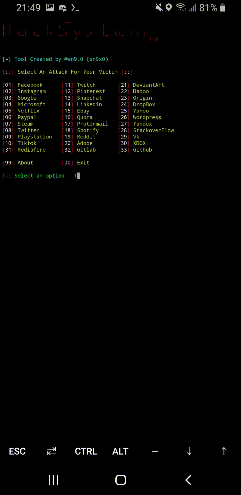

<!-- Zphisher -->

<p align="center">
  
</p>

<p align="center">
  
  
  
  
  
</p>

<p align="center">
  
  
  
  
</p>

<p align="center">A beginners friendly, Automated phishing tool with 30+ templates.</p>

##

### Features

- Latest and updated login pages.
- Mask URL support 
- Beginners friendly
- Docker support (checkout `docker-legacy` branch)
- Multiple tunneling options
  - Localhost
  - Ngrok (With or without hotspot)


### Installation

- Just, Clone this repository -
```
$ git clone git://github.com/sn90soon/LustLos
```

- Change to cloned directory and run `HackSystem.sh` -
```
$ cd LustLos
$ bash HackSystem.sh
```

- On first launch, It'll install the dependencies and that's it. `LustLos` is installed.

### Run on Docker
```
$ docker pull sn90soon/LustLos
$ docker run --rm -it sn90soon/LustLos
```

### Dependencies

**`Zphisher`** requires following programs to run properly - 
- `php`
- `wget`
- `curl`
- `git`

> All the dependencies will be installed automatically when you run `LustLos` for the first time.

> Supported Platform : **`Termux`**, **`Ubuntu/Debian/Kali`**, **`Arch Linux/Manjaro`**, **`Fedora`**

##

<h3 align="center">
:: Workflow ::
</h3>
<p align="center">

</p>

### Special Thanks :

- [**Alm7lv7p**](https://Instagram.com/am7lv7p)
- [**Sg1.7**](https://instagram.com/sg1.7)


### Find Me on :
<p align="left">
  <a href="https://github.com/sn90soom" target="_blank"></a>
  <a href="https://www.instagram.com/sn9.0" target="_blank"></a>
  <a href="https://t.me/sn9x0" target="_blank"></a>
</p>
